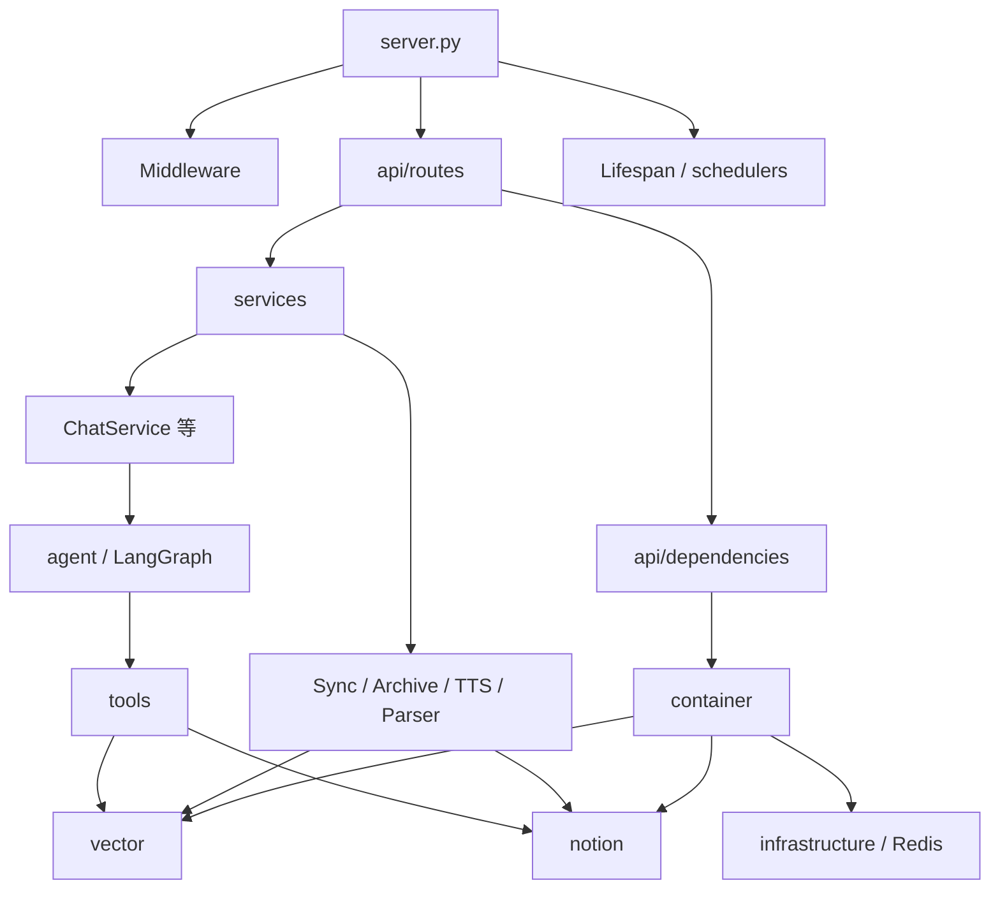

# BioBrain

企业级个人知识后端：**FastAPI** 接入层、**LangGraph ReAct Agent** 编排、**Notion** 权威知识库与 **Qdrant** 向量记忆的一体化系统。仓库内同时包含 **Next.js 15** 前端（`web/`），与 Python 后端解耦部署。

本文档面向**后端与新成员交接**：说明分层边界、`core/container.py` 的职责，以及模块间调用关系。

---

## 1. 系统分层总览

后端采用**分层 + 组合根（Composition Root）**：HTTP 与中间件只做接入；业务状态机与编排放在 `services/` 与 `agent/`；对外部系统（Notion、Qdrant、Redis、LLM）的访问集中在 `notion/`、`vector/`、`infrastructure/`，并由容器统一装配。

| 层级 | 主要职责 | 代表性路径 |
|------|----------|------------|
| **API 路由层** | HTTP 契约、鉴权挂载、`Depends` 解析 | `server.py`，`api/routes/*.py`，`api/dependencies.py` |
| **中间件与横切** | 限流、带宽、指标、全局异常 | `middleware/` |
| **业务服务层** | 用例编排：对话流、归档、同步、TTS、文件解析 | `services/` |
| **Agent / 工具层** | LangGraph 图、LangChain `@tool`，运行时从容器取依赖 | `agent/`，`tools/` |
| **Notion 交互层** | 页面/数据库 API、块构建 | `notion/` |
| **向量检索层** | 层次化分块、稠密/稀疏向量、混合检索与（可选）重排序 | `vector/` |
| **基础设施层** | 配置、Redis、日志、缓存降级 | `config/`，`infrastructure/`，`utils/` |

---

## 2. 调用关系（依赖方向）

下图用 **Mermaid** 概括**静态依赖与典型运行期调用方向**（`-->` 表示上层对下层的调用或注入关系；与原文 ASCII 树层级一致：`server` → `api` → `services` / `agent` → `tools` → `notion` / `vector` / 基础设施）。



**主链路（对话）**：`POST /chat` → `get_chat_service()` → `ChatService.stream_response` → `graph.astream_events` → LLM 按需调用 `tools_list` → 工具内部通过 **`container`** 访问向量库与 Notion。

**数据流（对话，具象）**：用户输入 → FastAPI 路由与鉴权 → `ChatService` 组装 query / 上传文件上下文 → LangGraph 状态机按步流转 → Tool 动态调用 → **Notion / Qdrant（经工具与容器）**读写或检索 → LLM 续写 → **SSE/流式**将 token 推回客户端。

**主链路（知识入库）**：`SyncService` / `manage_notion_note` 等 → `NotionService` 与 `LevelChunkVectorStore.add_memory` 保持内容与索引对齐。

**数据流（知识入库，具象）**：Notion 页面或 Agent 写入请求 → **业务服务或工具**校验与编排 → **Notion API** 落库页面与块 → **向量层**分块与嵌入后写入 **Qdrant**（必要时更新 `doc_store` 同步标记）→ 后续检索与对话侧可见同一知识。

---

## 3. `core/container.py`：依赖注入容器如何统筹全局

`Container` 是后端的**组合根**：不追求重型 IoC 框架，而是用**显式方法**构造依赖图，避免 `services` ↔ `agent` 之间的循环 import（部分工厂方法内 **延迟 import** `ChatService` 等）。

全局单例：

```python
# core/container.py 末尾
container = Container()
```

### 3.1 装配列表（与方法职责）

| 方法 | 产物 | 说明 |
|------|------|------|
| `config()` | `SETTINGS` | Pydantic 配置单例 |
| `redis_client()` | `RedisClient.get_instance()` | 缓存客户端 |
| `cache_wrapper()` | `CacheWithFallback` | Redis 不可用时的降级策略 |
| `vector_store()` | `LevelChunkVectorStore` | Qdrant 集合、嵌入、层次化分块 |
| `hybrid_search_engine()` | `HybridSearchEngine` | 复用 `vector_store` 的 client 与 `embedding_provider`，并注入 `notion_service()` |
| `notion_service()` | `NotionService` | Notion Token 与默认 DB |
| `llm_factory(model=...)` | `ChatOpenAI` | 统一基 URL / Key / 流式与超时 |
| `chat_service()` | `ChatService` | 注入 config、notion、llm_factory、cache |
| `archive_service()` | `ArchiveService` | cache + vector + notion |
| `audio_service()` | `AudioService` | TTS |
| `sync_service()` | `SyncService` | notion + vector |

### 3.2 与 FastAPI 的衔接

`api/dependencies.py` **只依赖 `container`**，将上述方法包装为 `get_chat_service()`、`get_vector_store()` 等，供路由 `Depends` 使用。这样路由层不直接 `new` 业务类，**所有单例与装配顺序在 `Container` 内可见**。

### 3.3 与 Agent / Tools 的衔接

`agent/agent_graph.py` 与多数 `tools/*.py` **直接 import `container`**，在工具执行期按需调用 `container.vector_store()` 等。这与「请求级 Depends」并存：HTTP 路径走 `dependencies.py`；**图与工具在异步/线程边界内自行从容器解析**，注意避免在模块顶层引入尚未就绪的循环依赖（项目中已通过延迟 import 与函数内 import 处理）。

### 3.4 GitNexus 依赖图谱（`IMPORTS core.container`）

在已索引仓库上可通过 GitNexus 复现「谁依赖容器模块」：

```bash
npx gitnexus analyze          # 索引过期时先执行
npx gitnexus cypher "MATCH (a:File)-[:CodeRelation {type:'IMPORTS'}]->(b:File) WHERE b.filePath CONTAINS 'core/container' RETURN a.filePath"
```

当前图数据中**直接 import 容器模块**的文件包括：`server.py`、`api/dependencies.py`、`agent/agent_graph.py`、`agent/conversational_search_agent.py`、`tools/tools.py`、`tools/block_operation_tools.py`，以及调度路径上的 `services/sync_service.py`、`services/search_session_manager.py` 等（部分为函数内导入以降低环风险）。

---

## 4. 技术栈（摘要）

- **运行时**：Python 3.10+，FastAPI，Uvicorn（见启动方式）
- **Agent**：LangGraph `create_react_agent`，LangChain tools
- **记忆与检索**：Qdrant，FastEmbed / 稀疏向量（可选），可选 Cross-Encoder 重排序
- **外部系统**：Notion API，Redis（hiredis）
- **前端**：Next.js 15，React 19，Tailwind（详见 `web/package.json`）

---

## 5. 目录结构（后端相关节选）

```text
.
├── server.py                 # FastAPI 应用入口（app 实例）
├── api/
│   ├── dependencies.py       # Depends → container
│   └── routes/               # chat, files, admin, system
├── core/
│   └── container.py          # DI 容器与全局 container 单例
├── config/
│   └── settings.py           # SETTINGS
├── services/                 # 业务服务
├── agent/                    # LangGraph 与对话搜索子图
├── tools/                    # LangChain 工具定义
├── notion/                   # NotionService、块操作与 Markdown→块
├── vector/                   # vector_store、hybrid_search、doc_store 等
├── infrastructure/           # Redis 等
├── middleware/
├── utils/
├── tests/
└── web/                      # Next.js 前端
```

---

## 6. 环境与启动

### 6.1 先决条件

- Python 3.10+
- Node.js 18+（仅前端）
- Redis、Qdrant、Notion 与 LLM 提供方凭证（见 `.env.example`）
- **基础设施本地实例**：新人单独安装 Redis / Qdrant 往往最耗时；**推荐使用项目根目录的 `docker-compose.yml`，执行 `docker-compose up -d` 一键拉起 Redis 与 Qdrant 的本地实例**（再按 `.env.example` 将连接串指向容器端口）。

### 6.2 后端

```bash
python3 -m venv venv
source venv/bin/activate
pip install -r requirements.txt
# 配置 .env（勿提交仓库；以 .env.example 为准）
python server.py
# 或：uvicorn server:app --host 0.0.0.0 --port 8000
```

亦可使用项目根目录 `./start.sh`（会检查 `.env` 并在前台启动 `server.py`）。

### 6.3 前端

```bash
cd web && npm install && npm run dev
```

默认前后端地址以本地配置为准（例如 API `http://127.0.0.1:8000`，前端 `http://localhost:3000`）。

### 6.4 测试

```bash
pytest
cd web && npm run test
```

---

## 7. 可观测性与向量内存

- **Prometheus**：中间件暴露 `/metrics`（见 `server.py` 与 `middleware/metrics.py`）。
- **模型懒加载与卸载**：服务端后台调度会调用 `vector_store` / `hybrid_search_engine` 上的空闲卸载逻辑；详见环境变量说明（如 `ENABLE_SPARSE_MODEL`、`ENABLE_RERANKER`、`MAX_MEMORY_MB`）。进程级内存观测与手动清理见 `server.py` 中注册的 **`GET /api/memory`**、**`POST /api/memory/cleanup`**（与健康检查 `api/routes/system.py` 的 `/health` 并列）。

---

## 8. 开发规范

详细约定（命名、异常策略、与前端 Hook 同步等）见仓库根目录 **`CLAUDE.md`**。修改 LangGraph 节点或 API 契约时，请同步验收流式行为与工具返回 JSON 格式，避免 Agent 侧无法解析。

---

## 9. 文档与图谱维护

- 架构检索与影响分析：**GitNexus**（`npx gitnexus status | analyze | query | context | impact | cypher`）。
- 提交较大重构后建议重新 `npx gitnexus analyze`；若索引含嵌入，需按 `.gitnexus` 文档保留 `--embeddings` 参数，避免误删嵌入索引。

---

## 10. 贡献

欢迎 Issue 与 Pull Request；新增模块时优先通过 **`Container` 新增工厂方法** 或 **`api/dependencies.py` 暴露 Depends**，保持接入层与基础设施边界清晰。
